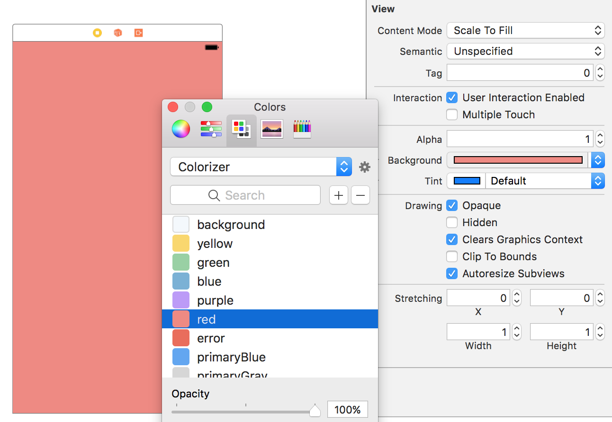

# This project is no longer maintained

Please check [Named Colors](https://blog.zeplin.io/asset-catalog-colors-on-xcode-9-c4fdccc0381a) (available from Xcode 9). It's possible to use it with [`SwiftGen`](https://github.com/AliSoftware/SwiftGen/)

# Colorizer

[](https://img.shields.io/cocoapods/v/Colorizer.svg)
[](http://cocoadocs.org/docsets/Colorizer)

Colorizer is a tool written in Swift to auto-generate a Apple's Color Palette file (`.clr` file) from `.txt` file.

In result you can:
* use the same colors in code and storyboards
* share project colors
* be sure that you are always up to date



## Installation

* **Via CocoaPods**

  Simply a `pod 'Colorizer'` to your `Podfile`.

  Now you can use Colorizer in Build Phases invoking `$PODS_ROOT/Colorizer/bin/colorizer`.

* **Via [Homebrew](http://brew.sh)**

  You can install Colorizer just by: `brew install arturjaworski/formulae/colorizer`

## Usage

```sh
colorizer generate /path/to/colors-file.txt /path/to/output-color-palette-file.clr
```

This will generate a Apple's Color Palette file with all colors listed in the text file passed as argument.

Your input text file should be contain one color per line, each line being composed by the Name to give to the color, followed by `:`, followed by the Hex representation of the color (like `rrggbb` or `rrggbbaa`, optionally prefixed by `#` or `0x`). Whitespaces are ignored. Almost the same as used in [`SwiftGen`](https://github.com/AliSoftware/SwiftGen/).

It means it's looks like:

```
Black       : #000000
White       : ffffff
Translucent : 0x111111cc
Title       : #ff0000
```

## Tips & Tricks

1. Generate Swift code from the same `.txt` file by [`SwiftGen`](https://github.com/AliSoftware/SwiftGen/).

2. Share your `.txt` files in your project directory.

3. Integrate Colorizer with your Xcode project to regenerate `.clr` file on every build using Build Phases.

4. Install your color palette in your system placing it in `~/Library/Colors/`.

  Also you can add it as "Run Script Phase": `ln -sf ${SRCROOT}/color-palette.clr ${HOME}/Library/Colors/${PRODUCT_MODULE_NAME}.clr`

# License

This code and tool is under the MIT License. See `LICENSE` file in this repository.

It also relies on [`SwiftCLI`](https://github.com/jakeheis/SwiftCLI/blob/master/LICENSE) and [`PathKit`](https://github.com/kylef/PathKit/blob/master/LICENSE) licenses.

---

Any ideas and contributions are welcome!
